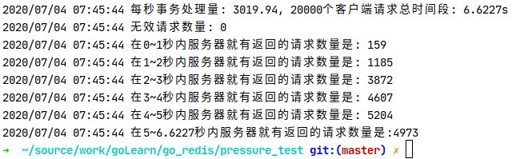
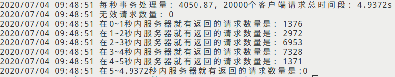
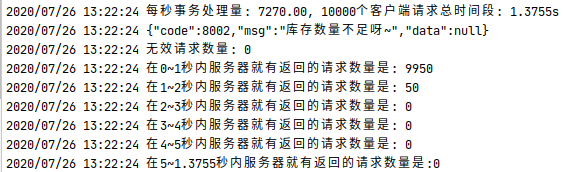
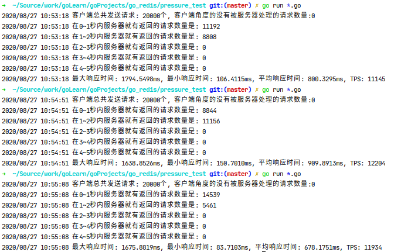
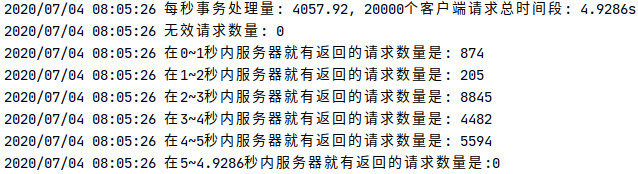
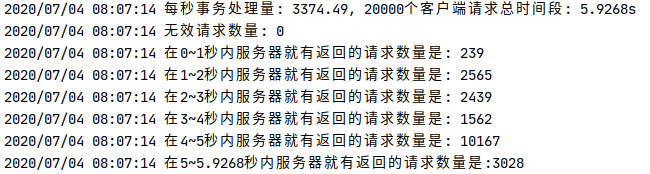

# 单体redis商品抢购Demo

- 思路

    用户请求的三个参数分别为: 用户Id, 商品Id, 商品数量, 其中, 用户Id默认是经过网关校验的, 这里不做验证.
    
- 特征:

    - [x] 支持多个商品库存初始化, 同时抢购
    - [x] 限制用户是否可购买, 可购买的商品的总数量(userFilter函数内容可以自定义)
    - [x] 支持订单取消
    - [x] 订单号使用ksuid, 类似于uuid
    - [ ] 生成订单后内容传输给队列, 如rabbitmq, 写入Mysql数据库
    - [ ] 完善前端+用户ID(合法性, cookie或者token)校验

- 应用情景

    1. 公司需要部署一个活动, 卖出商品a 100件, 限制每个人只能购买同款商品1件;
    2. 卖出商品a 100件, 商品b 100件, 商品a限制每个人只能购买2件, 商品b限制每个人只能购买1件;
    
    
- 流程
    

- 部署方法

    - 打包成二进制文件, 通过nginx转发, 或者直接使用裸二进制文件
        1. 部署redis, 端口号: 6379, AUTH: "hello"
        2. cd redis_play && go build -o redis_play *.go && ./redis_play
        3. 运行redis_play, 如果使用的是VPS, 注意打开公网端口号: 6379
        4. 可以使用Postman测试功能, 用位于pressure_test目录下的压测脚本测试并发性能, 
           目前只覆盖了两种场景(1. 20000名用户同时抢购productId: 10000的商品(库存:200), 2. 20000名用户同时抢购2种商品, productId:10000, productId:10001, per 200件库存)
    - 做成docker

- 注意:

    1. redis.conf里面的maxclients默认是10000, 我发现用20000clients去测试的时候, 会报错, 因为server不能承受太大量的clients conn, 所以最好修改的大一点吧(😉我就改了10w)

- 性能测试

    - 测试场景
    
        系统: Ubuntu 20.04 LTS
    
        CPU: Intel i5 8250U (4H8T) (runtime.GOMAXPROCS设置为1个线程, 但通过htop发现, 8个线程全部被占用了, 我也不知道咋回事,  This call will go away when the scheduler improves, 意思是升级了scheduler所以这个go sway了?)
    
        内存占用(反复跑pressure_test后停在了这个地方):
    
    1. 用户20000名, 同时请求: /buy, 购买商品, 商品ID: "10000", 购买数量: 1库存数量: 200件, 测试结果如下:
    
    第一次测试:
    
    
    检查redis-db0, 发现没有超卖, 订单生成正常, 用户购物车数值正常
    
    第二次测试:
    
    
    
    第三次测试:
    
    
    
    2. 20000名用户, 其中10000名用户抢购商品"10000", 库存为200, 10000名用户抢购商品"10001", 数量为200, 测试结果如下:
    
    第一次测试:
    
    
    检查redis-db0, 发现没有超卖, 订单生成正常, 用户购物车数值正常
  
    第二次测试:
    
    
    
    第三次测试:
    
    